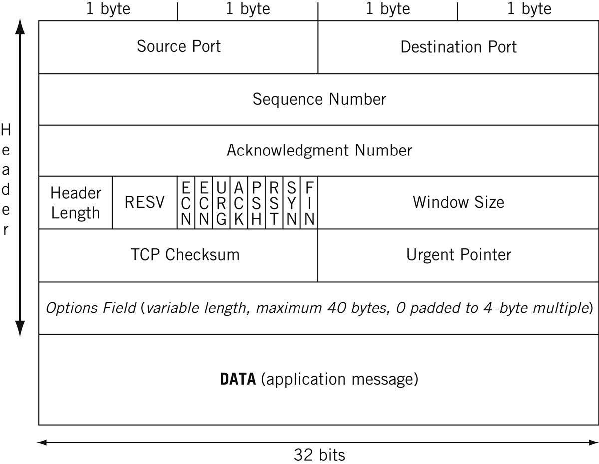

# TCP/UDP over IPv4

* TCP/UDP headers
* Use cases of TCP and UDP
* Flow control algorithms of TCP
* Exercises

## TCP/UDP Layer

* Sits on level 4 of OSI stack
* Above IP layer

## TCP/UDP Headers

Easy one first!

### UDP Headers

* UDP - User Datagram Protocol
* Also called Unreliable Datagram Protocol
* Fixed header size 8 bytes
* Port
  * Application packet is generated/destined for
  * Also used for NAT mapping by routers
* Length is header size (min 8) + data (max 65535)

### TCP Headers

* Sequence Number - Basis for tracking segments
* Acknowledgement Number - Acknowledging segment recieved. Next expected sequence number
* Header length - TCP Header length in 4-byte units. Varies depending on options.
* RESV - Reserved for future use
* Window size -  RECV window size set in destination host
* 
* ECN Flags - Explicit Congestion Notification bits.
* Urgent pointer - Used to indicate an important data before "normal" contents
  * When pressing ctrl+c in a telnet session
  * Generally used very rarely in normal operation
* Options (Upto 40 bytes)

## Exercise

* Open wireshark
* Put in filter for `tcp`
* Some fields not in header marked as '[]'
* Explain where do they come from ?

## Start sequence

* TCP Requires 3-way handshake before sending application data
* UDP just fires data, hoping it reaches the other end

## TCP and UDP use cases

| Aspect                   | TCP                               | UDP                               |
|--------------------------|-----------------------------------|-----------------------------------|
| **Reliability**          | Provides reliable data delivery.  | Unreliable; no guarantee of delivery. |
| **Connection**           | Connection-oriented.              | Connectionless.                   |
| **Order of Delivery**    | Ensures data is delivered in order. | No guarantee of order.            |
| **Acknowledgments**      | Uses acknowledgments for data delivery. | No acknowledgments.              |
| **Error Checking**       | Includes extensive error checking and correction. | Minimal error checking.          |
| **Flow Control**         | Implements flow control mechanisms. | No built-in flow control.         |
| **Latency**              | Generally has higher latency due to connection setup. | Lower latency, quicker transmission. |
| **Overhead**             | Higher overhead due to headers and handshaking. | Lower overhead, minimal header size. |
| **Applications**         | Ideal for applications requiring data integrity and reliability, such as web browsing, file transfers. | Suitable for real-time applications, gaming, streaming, where speed is crucial. |
| **Examples**             | HTTP, FTP, SMTP, SSH.              | DNS, VoIP, online gaming.          |

## Exercises 1

* Run a xmass-scan and null-scan
* On client1 run xmass-scan `nmap -sX -p 12345 192.168.57.21`
* On server1 then open a port by `socat TCP4-LISTEN:12345,fork,reuseaddr EXEC:cat` and run the `nmap` command again
* What happens ? Observe the packet on wireshark and explain
* Repeat the exercise for null-scan by changing the flag to '-sN'. Explain.

## Flow control in TCP

### Problem

* Streaming 4K netflix, bandwidth saturated
* Someone else started software update
* Packet drop at intermediary router
* To resolve TCP has a number of algorithms to avoid such a scenario

### Slow start

* Way to estimate reciever bandwidth
* Server side inits a Congestion Window (cwnd) variable
* The rate is doubled after every ACK
* Advantages ? Disadvantages ? 

### Congestion avoidance
* Active research area
* Originally Multiplicative Decrease and Additive Increase (AIMD) used
* Currently Propotional Rate Reduction (PRR) is standard

## Exercise 2

* Change congestion window
* Run iperf3 throughput test between `server1` and `client1` for 2 minutes. Observe bandwidth.
* Run `ip route change default via <ip> dev <IF> proto static initcwnd 10` on `server1`
* Run `ip route show` to verify
* Run `ip route change default via <ip> dev <IF> proto static initcwnd <your-choice-value>` on `server1`
* What do you expect? Why? What actually happens ?

## Homework

* What happens when sending packet with different MTU sizes
* Play around with different TCP options in the kernel and explain its impact on the network
* sysctl -a | grep tcp