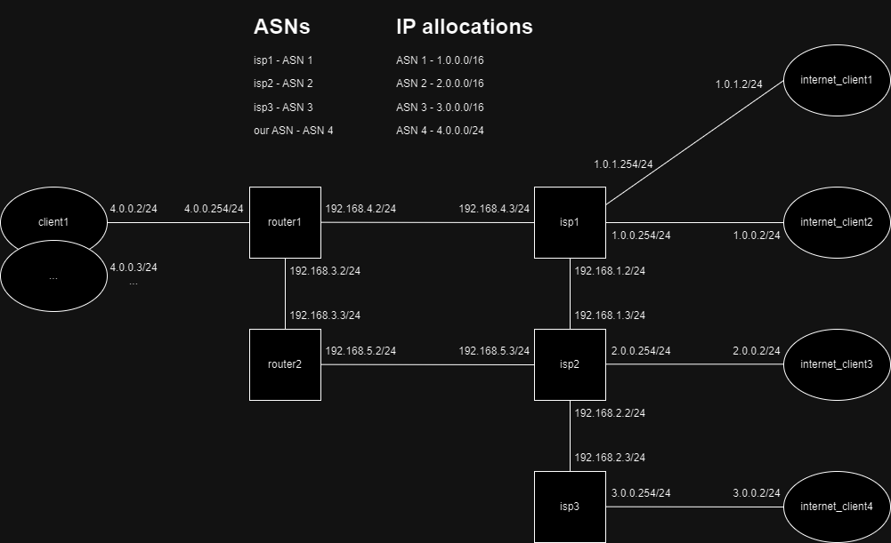

Here's the setup for today's training:


We are a mid-sized company with multiple servers makred on the drawing as clinet1...clientN.
We have an allocated ASN number 4 and a pool of IP addresses 4.0.0.0/24.
We want to setup our infrastructure in a way that our servers are accessible from the internet.
The end users on the internet are marked as internet_clinet1..internet_clinet4.
The whole Internet in our example is made of 3 ISPs: ISP1, ISP2 and ISP3 which have their own ASNs and IP pools. ASN1, ASN2, ASN3 and 1.0.0.0/16, 2.0.0.0/16, 3.0.0.0/16 respectively.

At the very beginning let's investigate how the current connections work. Let's log into isp1's router and check the routing table, RIB table and BGP configuration.
To enter router's shell use:
```
vtysh
```
To see BGP config use:
```
show running-config
```
To print RIB use:
```
show bgp all
```
To see BGP summary use:
```
show bgp summary
```
Try to ping internet_clinet4 from internet_clinet1. Does it work? Why?


Now is the time to connect our servers to the internet. In order to do that we first need to talk to ISP1 to configure BGP peering with them. Also we should let them now that we have our own IP pool that we're going to advertise. They will setup their router and add policies to accept and propagate our advertisements. This part is already done. The ips1 router is configured and expects our peering. Let's coufigure our router1 in order to establish the peering. We need to add a new BGP neighbor and advertise our IP pool. Let's do it:
```
vtysh
configure
router bgp 4
 bgp router-id 4.0.0.0
 no bgp ebgp-requires-policy
 neighbor 192.168.4.3 remote-as 1
 address-family ipv4 unicast
  network 4.0.0.0/24
 exit-address-family
exit
```
Now let's log into client1, set router1 as default gateway and try to ping internet_clinet4.
Let's take a look at the configuration of router1.

Now we figure out that it would be good to have some redundancy in our setup.
Let's add another router to our network and configure it to peer with IPS2.
This way our servers have two paths to the internet.
Let's configure router2 to peer with ISP2 via eBGP and our router1 via iBGP.
Do not add any networks to advertise to this router.

What is the route from client1 to internet_clinet3? Why?
What does traceroute show?
What is the route the other way around? Why?

Let's try to fix it together. We need to set next-hop-self on router1 and router2.

What is the route from client1 to internet_clinet3 now? Why?
What does traceroute show?

Now let's log into isp1 router and put down the link between isp1 and isp2. What happens to the traffic?
Why? Is it good or bad? Why? How to avoid it?

Now let's log into isp1 router and put the link between isp1 and isp2 back up. Fix the problem and put the link down again. Did the situation improve?
Hint: we need to setup some export policies on our routers. prefix-list and route-map are your friends.

Homework:
Try to create a policy using local-preference to change routing configuration
