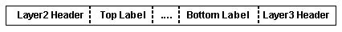

# What is MPLS

IETF RFC 3031: https://www.rfc-editor.org/rfc/rfc3031

MPLS is a routing technique that is based on labels instead of network addresses. When routing, an MPLS router only needs to look at the label to determine how to route the packet, without needing to inspect the original header or the packet in any other way.

MPLS sits between OSI layers 2 and 3, being like layer 2.5. Since MPLS only looks at the labels, it is protocol-agnostic, hence "Multiprotocol".

## Competing technologies

MPLS was created as an alternative to technologies like Frame Relay and Asynchronous Transfer Mode (ATM) to connect different networks. 

MPLS is not used much today to has been largely superseded by newer technologies like Software-defined WAN (SD-WAN).

## Terms/definitions

### Label

A label is a 32-bit value used for routing in MPLS. It consits of four fields:
- Label value (20 bits)
- Traffic control field (3 bits)
- Bottom of stack flag (1 bit)
- TTL (8 bits)

The traffic control field was used to be called experimental use, abbreviated as exp, but was later renamed to traffic control. It is used for things like QoS and ECN (Explicit Congestion Notification).

The bottom of stack flag simply denotes if the label is the last label in the label stack (more on that soon), before reaching the original header.

The TTL value behaves just like in IP, being decremented by 1 for each hop it traverses. The point being that when the packet leaves the MPLS domain, the TTL value should be as if MPLS was not involved at all.

32 bits in total, used to identify an FEC. A label can only identify one FEC, but one FEC may be identified by multiple labels.
20 bits: label value
3 bits: Traffic class field (used to be called experimental use, or exp. Flexible use, often for QoS or Explicit Congestion Notification)
1 bit: indicates if label is at the bottom of the stack
8 bits: TTL (behaves like normal IP TTL, gets decremented for each hop. When the packet exits the MPLS domain the TTL value should be as if MPLS was not involved at all)

The MPLS label(s) sit between the layer 2 and layer 3 headers, like so:



### Label stack

A packet can have multiple labels, organized as a stack. An unlabeled packet can be seen as a packet with a label stack size of 0, a packet with one label as having label stack size 1, etc.

Processing is always done on the topmost label and is completely independent on whatever labels might exist lower in the stack or what labels might have been there before.

Having multiple labels is useful when creating nested MPLS networks.

### Forwarding Equivalence Class (FEC)

A group of packets to be routed along the same path, with the same forwarding treatment.

And FEC is usually based on the destination address, but can be based on anything.

### Label-Switched Router (LSR) and Label-Switched Path (LSP)

An LSR is an MPLS node that is capable of forwarding labeled packets. 

An LSP is a path that goes through one or more LSRs.

An LSR can be denoted in different ways depending on where it sits in the LSP:

- **Ingress LSR**: The node through which a packet enters the MPLS network
- **Egress LSR**: The node through which a packet exits the MPLS network
- **Egde LSR**: Ingress or Egress LSR
- **Transit LSR**: Any LSR that is not an edge LSR

LSRs and LSPs are unidirectional, packets only flow in one direction. To get bidirectional traffic, a separate LSP has to be created.

When a packet moves through an LSP, it moves from upstream to downstream. For a network `->R1->R2->`, `R1` is upstream from `R2` and `R2` is downstream from `R1`.

### MPLS network

An MPLS network is a self-contained set of LSRs. The network can either be standalone, or nested within another MPLS network.

An MPLS network can also be called a tunnel. MPLS itself doesn't support encryption but MPLS also doesn't care if the packets it forwards are encrypted, as long as the packet can be assigned to an FEC.

### Next Hop Label Forwarding Entry (NHLFE)

An NHLFE is used when forwarding a labeled packet and contains at least:
- The packet's next hop
- What operation(s) to perform on the label (replace, pop, replace and push)

The NHLFE can point to the same LSR again, in which case the label operation must be to pop it from the stack, after which the LSR makes another forwarding decision which can then be on either a label or the native IP packet.

### Incoming Label Map (ILM)

The ILM is used to map a label to a set of NHLFEs. It is only used for labeled packets.

### FEC-to-NHLFE Map (FTN)

The FTN is used for unlabeled packets that are to be labeled before being forwarded. It maps an FEC to a set of NHLFEs.

# How does it work?

### How are labels created an assigned

Two LSRs, Rd and Ru, have to agree to a binding between a label L and an FEC F for packets moving between them. In that case L is an outgoing label representing F for Ru and an incoming label representing F for Rd. L is an arbitrary value and is only used between Ru and Rd.

Rd will not always be able to tell if the label was set by Ru or by some other LSR earlier n the LSP. As a result Rd must make sure that there is a one-to-one mapping from L to F. Rd must not agree to bind a label to multiple FECs unless it can determine fully that the label on the packet was set by Ru and not some other earlier LSR.

For routers Ru and Rd, Rd decides to map a label L to an FEC F and then informs Ru about that mapping/binding. Labels are "downstream-assigned", downstream informs upstream about the label mappings. This is opposite to normal traffic, which moves from upstream to downstream.

### Label uniqueness

If Rd binds label L to FEC F1 and sends that to Ru1 and binds label L to FEC F2 and sends that to Ru2, F1 has to be the same as F2, unless Rd can determine when receiving a packet which LSR put the label there. If so, Rd is said to use different label spaces for the labels it shared with Ru1 and Ru2. If Rd cannot determine which LSR put the label there, then each label can only be used for a single FEC

There are specific conditions under which Rd can determine that, that can be read about it in the RFC.

### Label distribution protocol

A label distribution protocol is a set of procedures an LSR uses to inform another LSR of its label/FEC bindings. Those two LSRs becomes label distribution peers and there will be a "label distribution adjacency" between them.

Two LSRs being label distribution peers doesn't mean that they share all of their bindings.

The LDP also lets two LSRs negotiate to learn about each other's MPLS capabilities. 

There are multiple LDPs. Some are extended version of existing protocols, like BGP and RSVP (Resource Reservation Protocol), and some are new protocols created explicitly for MPLS label distribution, like LDP and CR-LDP (Constraint-based Routing Label Distribution Protocol).

### Unsolicited downstream vs downstream-on-demand

The MPLS architecture allows LSRs to explicitly request a specific label/FEC binding from it's next hop. This is known as "downstream-on-demand" label distribution.

The MPLS architecture also allows LSRs to distribute bindings to LSRs without being asked. This is known as "unsolicited downstream" label distribution.

MPLS implementations may provide either distribution method, or both. While both methods may be used at the same time, adjacent LSRs must agree to which method(s) they allow.

### Label retention mode

Ru may have, or will receive, bindings from Rd even if Rd is not, or is no longer, Ru's next hop for the a specific FEC.

Ru needs to decide whether to keep track of those bindings. If Rd later becomes Ru's next hop for an FEC, the old bindings can be used if they were retained, but if they were discarded then Ru needs to reaquire the bindings.

- **Liberal Label Retention Mode**: the bindings are kept, allows the LSR to more quickly adapt to routing changes
- **Conservative Label Retention Mode**: the bindings are discarded, the LSR can maintain fewer labels

### Label swapping

For a labeled packet, the LSR looks at the topmost label, looks up in the ILM what the NHLFE for that label is. With the NHLFE it determines where to forward the packet, performs and operation on the packet's label stack, encodes the new label stack onto the packet, and then forwards the packet

For an unlabeled packet, the LSR looks at the network layer header to determine the packet's FEC, that is then used to get the NHLFE from the FTN. With the NHLFE the LSR determines where to route the packet, adds one or more labels to the packet's label stack, encodes it, and forwards it.

### Ordered vs independent

In independent LSP control, when an LSR recognizes a particular FEC, it makes an independent decision to bind a label to the FEC and distribute the binding to its label distribution peers.

In ordered LSP control, an LSR only binds a label to an FEC if it is the egress for the FEC or if it received a label binding from the next hop for that FEC. 

If you want to ensure that packets in an FEC follow a specific path (e.g. no loops, specific LSP, etc.) you must use ordered LSP control. 

Each LSR can decide whether to use ordered or independent, but unless all LSR in an LSP are using ordered control, independent control is effectively used.

### Penultimate Hop Popping (PHP)

Let's say we have an LSP `> R1 -> R2 -> R3 >`, in this case `R3` is the egress before the packet leaves the current MPLS domain. In this case, when a packet travels through the LSP, the last label for the domain can either be popped at `R3` or at `R2`. 

Popping the last label at `R3` would be conceptually simpler, but popping at `R2` instead has several benefits, and since the purpose of the label is to get the packet to the egress, in this case `R3`, the label doesn't serve a purpose once it leaves `R2`. Popping it at `R2` in this case is what is known as Penultimate Hop Popping.

Without PHP, an egress router would need to do two lookups for each packet it receives. First it would look at the top label and see that the label points to the current LSR and so pop that label, and then do another lookup for the next label/network layer header. 

With PHP, the penultimate LSR in the LSP, here `R2`, can determine if it is the penultimate hop, has already made a lookup for the label and can pop it already, thus saving one lookup on the egress. 

The label switching code can be simplified if it can assume that only a single lookup will ever be needed. Also, with PHP, the egress doesn't always need to be an LSR since the egress would receive a packet without any labels on it.

Not all hardware switching engines can pop the stack, so it cannot be guaranteed that PHP can be used, and there can be situations (that are not elaborated on in the RFC) when PHP is not desirable. Because of that, PHP is only used if specifically requested by the egress node or if the next node in the LSP doesn't support MPLS.

An LSR that can pop the stack must do so if requested by its downstream label distribution peer. Initial label distribution protocol negotiations must allow each LSR to determine whether its neighboring nodes are capable of popping the stack. An LSR must not request a peer to pop the stack unless that peer is capable of doing so.

### Invalid or missing labels

If an LSR receives a packet where the label is invalid, or it has no mapping for that label, it must discard the packet, otherwise a routing loop may happen. For example, Ru sends a packet to Rd and Rd doesn't have a binding for the label. If Rd pops the label to route the packet by the next label or plain IP, then the packet may end up at Ru again where the process is repeated.

### Route selection

There are two types of routing in MPLS:

- **Hop-by-hop routing**: Each node independently selects the next hop for each FEC
- **Explicitly routing**: The LSP ingress or egress specifies several, or all, of the LSRs in the LSP. If a single LSR specifies the entire LSP, it's called *strictly explicitly routed*, and if a single LSR only specifies some of the LSP, it's *loosely explicitly routed*.

Which routing method to use can be chosen by configuration, or an LSR, like the egress, selects the LSP dynamically.

### Aggregation

One way of partitioning traffic into FECs is to create a separate FEC for each address prefix which appears in the routing table. But then you might end up with multiple FECs where the traffic follows the exact same route. The union of those FECs would itself be an FEC. This leads to the question whether a label should bind to the union of FECs or to a single FEC.

Binding the label to the union of FECs is called aggregation and reduces the number of labels needed to handle a particular set of packets, which in turn may reduce the amount of label distribution control traffic needed.

Given a set of aggregatable FECs, you can choose between not aggregating, aggregating into a set of of FECs, or aggregating into a single FEC, with no aggregation having the finest granularity and aggregating to a single FEC having the coarsest granularity.

When ordered control is used, an LSR should use the same granularity as its next hop. With independent control, each node may have different granularity.

If Ru has a finer granularity than Rd, then Ru can either remap the labels when forwarding a packet to Rd, or update it's own label mappings and distribute those to its own label distribution peers. If Ru has a coarser granularity than Rd, then it is recommended that Ru adopt Rd's level of granularity and update its label bindings.

### Label merging

An LSR may receive multiple labels that map to the same FEC but it would be better to forward only a single label for that FEC. This is called label merging. However, having the separate labels for the different upstream LSRs gives some information about where the packet came from, and that information is lost when merging the labels.

Not all nodes are capable of doing label merging. The MPLS architecture accomodates both merging and non-merging, and allows for nodes that don't support merging.

# Exercises

## Static config

### Simple network

On node1
```
ip r add 192.168.59.14 via 192.168.57.12 dev eth0
```

On node2
```
tc qdisc add dev eth0 ingress

tc qdisc add dev eth1 ingress

tc filter add dev eth0 ingress protocol ipv4 flower dst_ip 192.168.59.14 action mpls push label 100 tc 2 ttl 64 action mirred egress redirect dev eth1 

tc filter add dev eth1 ingress protocol mpls_uc flower mpls_label 101 action mpls pop protocol ipv4 action mirred egress redirect dev eth0
```

On node3
```
tc qdisc add dev eth0 ingress

tc qdisc add dev eth1 ingress

tc filter add dev eth1 ingress protocol ipv4 flower dst_ip 192.168.57.11 action mpls push label 101 tc 2 ttl 64 action mirred egress redirect dev eth0

tc filter add dev eth0 ingress protocol mpls_uc flower mpls_label 100 action mpls pop protocol ipv4 action mirred egress redirect dev eth1
```

On node4
```
ip r add 192.168.57.11 via 192.168.59.13 dev eth0
```

#### First ping
On nodes 2-4
```
tcpdump -ni any
```

On node1
```
ping 192.168.59.14
```

#### Second ping
On nodes 1-3
```
tcpdump -ni any
```

On node4
```
ping 192.168.57.11
```

### Nested network
On node1
```
ip r add 192.168.61.16 via 192.168.57.12 dev eth0
```

On node2
```
tc filter add dev eth0 ingress protocol ipv4 flower dst_ip 192.168.61.16 action mpls push label 100 tc 2 ttl 64 action mirred egress redirect dev eth1 
```

On node3
```
tc filter add dev eth0 ingress protocol mpls_uc flower mpls_label 100 action mpls push label 200 tc 2 ttl 64 action mirred egress redirect dev eth1
```

On node4
```
tc qdisc add dev eth0 ingress

tc filter add dev eth0 ingress protocol mpls_uc flower mpls_label 200 action mpls pop protocol mpls_uc action mirred egress redirect dev eth1
```

On node5
```
tc qdisc add dev eth0 ingress

tc filter add dev eth0 ingress protocol mpls_uc flower mpls_label 100 action mpls pop protocol ipv4 action mirred egress redirect dev eth1
```

On nodes 2-6
```
tcpdump -ni any
```

On Node 1
```
ping 192.168.61.16
```

# Homework: Dynamic MPLS config

There are plenty of guides for how to set up MPLS with a dynamic config, a couple of examples being:
- https://blog.swineson.me/en/use-linux-as-an-mpls-router/
- https://liuhangbin.netlify.app/post/mpls-on-linux/

As homework, set up a small network with dynamic MPLS config.
