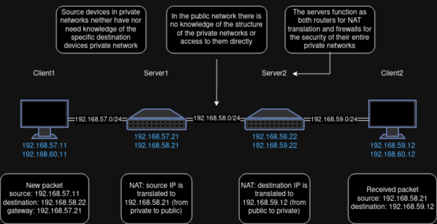
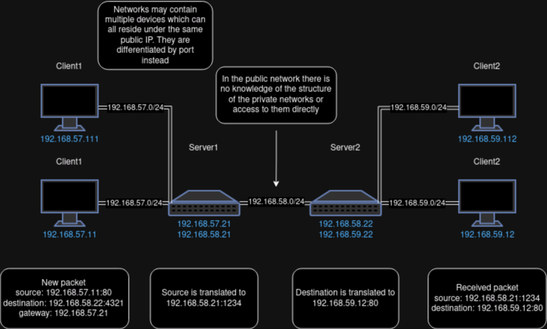

# NAT

## Network Address Translation

Network Address Translation (NAT) is used to separate private networks and the public internet. This is achieved by routing all of the private networks outgoing traffic through a gateway which functions as a router and firewall instead of directly connecting devices to the public network. This provides the following benefits:

- An extra layer of security to the private network, because all traffic goes through a firewall.
- A level of privacy for the network, because the public network has no knowledge of the devices and their configuration within it.
- Financial savings, because many devices in the private network can reside under one or just a few public IP addresses which need to be legally registered and are not free.

## Types of NAT

### Static

Most straight forward. The IP address of a device in the private network is mapped to a specific IP address in the public network with a one-to-one relationship.


Figure 1. NAT network diagram.

This model provides security and privacy to the private network, but does not solve the issue of having to use many IP address'es.

### Dynamic

The private network owns a pool of public IP's and assigns them to specific devices in the private network as needed. This essentially creates multiple static NAT configurations which are not permanent.

This approach still doesn't solve the issue of public IP usage when there are a lot of devices in the private network that need to be connected at the same time.

### Port Address Translation

Many devices IPs are mapped to just one single public IP, but the source ports are remapped so that each combination of IP and port are mapped to a unique combination of that one public IP and port.


Figure 2. PAT network diagram.

## NAT Tables

Mapping the correct ip and port combinations together is done on the router using a NAT table.

A NAT table is part of the collection of routing tables known as the "IP tables". It is the table that is consulted when a packet that creates a new connection is encountered.

IP tables are configured using the `iptables` package so you can reference it's [man pages](https://man7.org/linux/man-pages/man8/iptables.8.html) for more information on IP tables configuration.

To demonstrate how to use NAT tables let's setup `server1` to work as a router for `client1`.

### Server1 As A Gateway For Client1

Let's first configure `client1` to use `server1` as a router. For this we need to set the gateway IP of the default route of `client1` to the IP of `server1`. To make this happen we need to delete the old default route and add a new one.

Open a privileged terminal on `client1`:

```
docker exec --privileged -it client1 /bin/bash
```

The following command will list out all the routes:

```
ip route
```

The route that has the ip range `default` or `0.0.0.0/0` is the default route. I suggest you copy the entire line of the route and then paste it somewhere so you can restore it later (or you can just reboot your system). You can also paste it into a command like this to remove it:

```
ip route del <paste the entire line of the default route entry here>
```

Or you can simply delete the default route like this, but this way is less specific in case you have multiple default routes for some reason:

```
ip route del default
```

Now let's create a new default route which includes `server1` IP as the gateway:

```
ip route add default via 192.168.57.21 dev eth0
```

Here `192.168.57.21` is the IP of `server1` and `eth0` is the default interface of `client1` for the network between it and `server1`. Note that everything in the new default route should be the same as before except for the new gateway IP.

You can use `ip route` check if the gateway IP had been set correctly.

Now let's see what happens if we try and ping `server2` from `client1`.

```
ping 192.168.58.22
```

### Debugging Routing Issues

There is no response to the pings to `server2`. We can run `tcpdump icmp` on `server1` and `server2` to see where our packets are being lost. If everything is setup correctly up until this point in the workshop, you should see that on `server1` the packets are being received from `client1` and forwarded to `server2`, but `server2` isn't sending any responses. let's run `tcpdump icmp` on `server2`. Now we can see that `server2` is receiving the pings and responding to them, but the source IP of the pings is the IP of `client1` which is not accessible on any network of `server2`. In order to fix this we must enable masquerading on `server1`. When masquerading is enabled the packets that `server2` receives will have `server1` IP address so `server2` will be able to reach them and send responses.

>NOTE: ICMP is the internet control message protocol to which ping messages belong to.

### Enabling Masquerading On The Router

Open a privileged terminal on `server1`:

```
docker exec --privileged -it server1 /bin/bash
```

We'll need to modify the actual NAT table which is configured using the `iptables` package. It can be installed with the following command:

```
apt install -y iptables
```

The following command is required to enable IP forwarding on Linux, but the containers in our lab already have it enabled, so there's no need to run this command for this example:

```
echo 1 > /proc/sys/net/ipv4/ip_forward
```

The following command enables masquerading at the post-routing step for `eth1` interface.

```
iptables -t nat -A POSTROUTING -o eth1 -j MASQUERADE
```

You can check if this new iptables rule had been correctly updated by using `iptables -t nat --list` and looking under the POSTROUTING chain.

> NOTE: Here `eth1` is the default network interface on `server1` for the network between `server1` and `server2` which functions as the public network.

At this point of you ping between `client1` and `server2` you should receive a response and if you check the responding side with `tcpdump icmp`, you'll notice that now the source IP of the ping packets is the IP of `server1` instead of the original senders source IP address.

### Preventing Incoming Connections

There still is the issue that any device from the public network (in our case it's `server2` can send packets directly to `client1` by using `server1` as the gateway. We usually don't want to let devices from the public network directly access the devices in our private network, because they may be malicious.

You can test this by doing the following steps:

- Open a terminal on `server2`
- Set default path gateway IP to `server1` IP
- Ping `client1` from `server2`
- Pings get responses which means the public network has access to the private network via `server1`

You can use the following commands to block incoming new connections from the public network:

```
# Allow traffic from internal to external
iptables -A FORWARD -i eth0 -o eth1 -j ACCEPT
# Allow returning traffic from external to internal
iptables -A FORWARD -i eth1 -o eth0 -m conntrack --ctstate RELATED, ESTABLISHED -j ACCEPT
# Drop all other traffic that shouldn't be forwarded
iptables -A FORWARD -j DROP
```

# Homework

## Ping Between Client1 and Client2

Configure `server2` as the router for `client2` just like we configured `server1` to be a router for `client1` and successfully ping between `client1` and `client2`. Note that in order to reach a device that's inside a private network from a public network you;ll need to forward traffic from the router to the specific server's IP and the used protocol (which in this case is ICMP) using `iptables`.

submit this homework by sending me a screenshot of you successfully pinging between `client1` and `client2`.

## Telio Meshnet Routing

Route libtelio traffic through a container.

This homework is hard and thus not mandatory.

Libtelio supports routing traffic through another meshnet peer, but that does require some routing setup similar to the NAT routing setup that we used in todays workshop.

> NOTE: The following situation is an actual test setup I had to do while trying to debug an issue regarding Libtelio routing.

- Run a libtelio TCLI instance on two separate containers
- login to the same account and run meshnet on both instances
- configure the network interface address and set link up for both instances
- connect instance A to instance B using dev con <public key of node 2>
- make sure you can ping between the instances
- setup the routing so that all libtelio traffic of instance A gets routed through instance B
