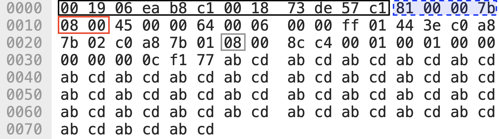
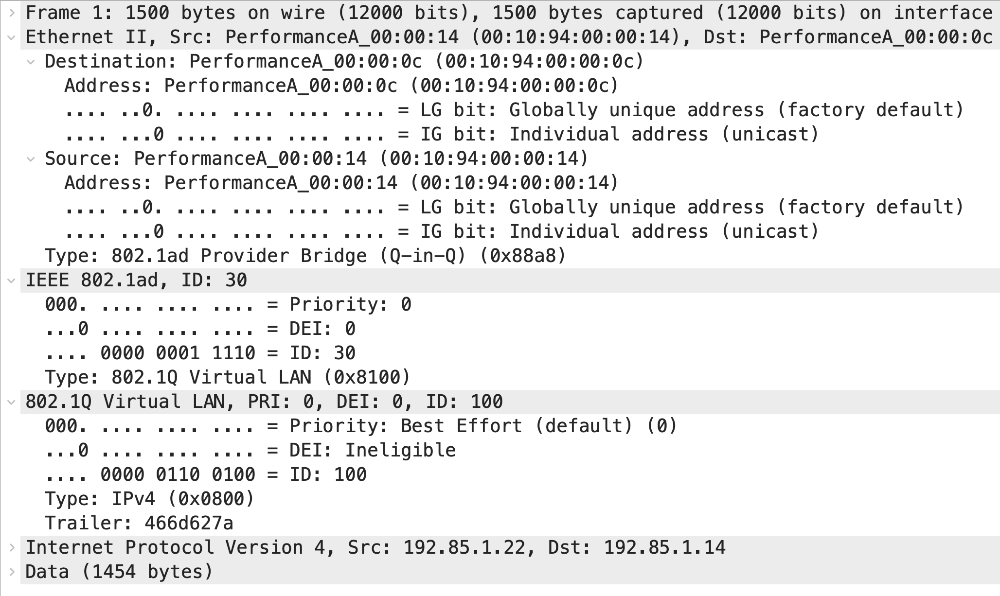

### 802.1q - Vlan

Let's start with the BUM data type. BUM stands for broadcast, unknown unicast, and multicast. When a LAN switch receives a frame that belongs to one of these types, it sends the frame to all its ports except the port it received the frame on. 

A broadcast domain includes all connected devices that get a copy of any broadcast, unknown unicast, or multicast (BUM) frame being sent.


By using VLANs, a single switch can act as two logical switches or creating two broadcast domains.


Advantages:
- Number of devices required to implement a given network topology can be reduced
- VLANs facilitate easy administration of logical groups of devices that can communicate as if they were on the same LAN
- Traffic between VLANs is restricted


TPID overlaps with the usual place of the `Ethertype`.  For 8021q vlans it is always equal to `0x8100` (IPv4 is `0x0800` and IPv6 is`0x86DD`) - this makes it possible to detect presence of vlan tags before the actual `Ethertype` field.

- Priority code point (PCP) is a 3-bit field which refers to the class of service (CoS) and maps to the frame priority level.
- Drop eligible indicator (DEI) is a 1-bit field. May be used separately or in conjunction with PCP to indicate frames eligible to be dropped in the presence of congestion.
- VLAN Identifier is a  12-bit field specifying the VLAN to which the frame belongs
Reserved VIDs:
  - 0x0 - The null VLAN ID. Indicates that the tag header contains only priority information
  - 0x1 - The default PVID value used for classifying frames on ingress through a Bridge Port
  - 0x2 - 0xFFF - Reserved for implementation use

Which means that there can be 4094 different vlans.

Example `ICMP Echo Request` (`0x8`) over IPv4 (`0x0800`) from 192.168.123.2 (`00:18:73:de:57:c1`) to 192.168.123.1 (`00:19:06:ea:b8:c1`) with VID 123 (`0x7b`):

>Because 802.1Q is a Layer 2 (Ethernet) standard, it only applies to the Ethernet header. At every Layer 3 boundary (router hop), the Layer 2 header, including CoS parameters, is stripped and replaced with a new header for the next link.
### Trunking

A VLAN trunk is an OSI Layer 2 link between two switches that carries traffic for all VLANs (unless the allowed VLAN list is restricted manually or dynamically).


#### Native vlan

Native vlan is a VID which will be assigned to untagged packets received from a trunk.


Additionally packets from sent to the trunk, will not have a vlan tag if they are from a native vlan.


### 802.1ad - Q in Q
Q-in-Q allows network operators to stack multiple layers of VLAN tags within an Ethernet frame, thereby creating a nested VLAN structure - which allows for 4094 * 4094 distinct VID pairs. This extension is particularly useful in service provider networks where customers require VLAN segmentation over a shared infrastructure.

Additional vlan tag is inserted between the one already there, and new TPID is used (`0x88A8`).

An example packet looks like this:

Example shows a situation where Q-in-Q is useful. If 'Acme' wants to connect offices in Seattle and Tacoma using infrastructure from 'Service Provider' and a different company 'XYZ' wants to do the same they might generate collisions of VIDs when traffic from both companies meets at the trunk S12. To solve that 'Service Provider' can select unique outer VIDs for both companies end encapsulate/decapsulate at boundaries in S-#1 and S-#2. This way the traffic on trunk S12 can travel without any collisions, regardless of the inner tags selected independently by both companies.


### Exercises
Before we start - traffic with vlan tags might be hard or impossible to capture - it's is stripped early on in the kernel and libpcap can't access it in some situations: [bug](https://bugzilla.redhat.com/show_bug.cgi?id=498981#c4)

#### Exercise 1

Verify that after starting network lab, all containers are in the same broadcast domain by running `ping -b 192.168.57.255` on client1 and on all other nodes `tcpdump -nvv -e -i any icmp`. On all nodes ping requests should be visible.

Example result:

```
19:37:10.359030 02:42:c0:a8:39:0a > ff:ff:ff:ff:ff:ff, ethertype IPv4 (0x0800), length 98: (tos 0x0, ttl 64, id 0, offset 0, flags [DF], proto ICMP (1), length 84)
    192.168.57.10 > 192.168.57.255: ICMP echo request, id 55, seq 13, length 64
```
#### Exercise 2
Setup vlan 10 connecting client1 and client2 and observe vlan tags:
```
client1$ ip link add link eth0 name eth0.10 type vlan id 10
client1$ ip addr add 192.168.58.10/24 dev eth0.10
client1$ ip link set dev eth0.10 up

client2$ ip link add link eth0 name eth0.10 type vlan id 10
client2$ ip addr add 192.168.58.11/24 dev eth0.10
client2$ ip link set dev eth0.10 up
```
Ping the vlan 10 broadcast address (`ping -b 192.168.58.255 -p cafef00d`) from `client1`.
Now check on client2 with tcpdump if you see vlan tags. Depending which interface you use, you will see different things. On eth0.10 there will be no tags:
```
20:36:46.167001 02:42:c0:a8:39:0a > ff:ff:ff:ff:ff:ff, ethertype IPv4 (0x0800), length 98: (tos 0x0, ttl 64, id 0, offset 0, flags [DF], proto ICMP (1), length 84)
    192.168.58.10 > 192.168.58.255: ICMP echo request, id 69, seq 91, length 64
```
On eth0 you will see those tags:
```
20:37:23.031016 02:42:c0:a8:39:0a > ff:ff:ff:ff:ff:ff, ethertype 802.1Q (0x8100), length 102: vlan 10, p 0, ethertype IPv4 (0x0800), (tos 0x0, ttl 64, id 0, offset 0, flags [DF], proto ICMP (1), length 84)
    192.168.58.10 > 192.168.58.255: ICMP echo request, id 69, seq 127, length 64
```
and if you listen on any you will see some errors:
```
$ tcpdump -nvvv -e -i any -X
tcpdump: data link type LINUX_SLL2
tcpdump: listening on any, link-type LINUX_SLL2 (Linux cooked v2), snapshot length 262144 bytes
20:46:45.367014 eth0  B   ifindex 381 02:42:81:00:00:0a ethertype IPv4 (0x0800), length 108: IP3 (invalid)
	0x0000:  390a 0000 4500 0054 0000 4000 4001 444f  9...E..T..@.@.DO
	0x0010:  c0a8 3a0a c0a8 3aff 0800 c3eb 0047 0120  ..:...:......G..
	0x0020:  352f 7265 0000 0000 3799 0500 0000 0000  5/re....7.......
	0x0030:  cafe f00d cafe f00d cafe f00d cafe f00d  ................
	0x0040:  cafe f00d cafe f00d cafe f00d cafe f00d  ................
	0x0050:  cafe f00d cafe f00d                      ........
20:46:45.367014 eth0.10 B   ifindex 2 02:42:c0:a8:39:0a ethertype IPv4 (0x0800), length 104: (tos 0x0, ttl 64, id 0, offset 0, flags [DF], proto ICMP (1), length 84)
    192.168.58.10 > 192.168.58.255: ICMP echo request, id 71, seq 288, length 64
	0x0000:  4500 0054 0000 4000 4001 444f c0a8 3a0a  E..T..@.@.DO..:.
	0x0010:  c0a8 3aff 0800 c3eb 0047 0120 352f 7265  ..:......G..5/re
	0x0020:  0000 0000 3799 0500 0000 0000 cafe f00d  ....7...........
	0x0030:  cafe f00d cafe f00d cafe f00d cafe f00d  ................
	0x0040:  cafe f00d cafe f00d cafe f00d cafe f00d  ................
	0x0050:  cafe f00d                                ....
```

Exercise 3

Configure vlan 20 on client3 and see if you will get the pings in vlan 10 broadcast domain.
